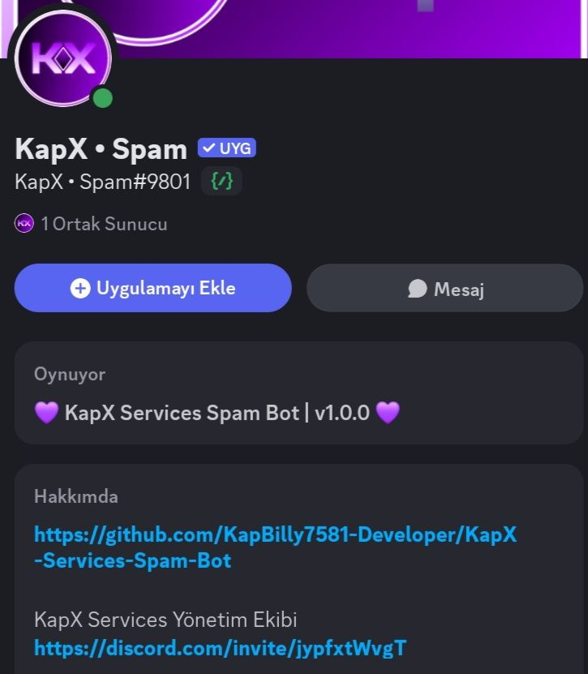
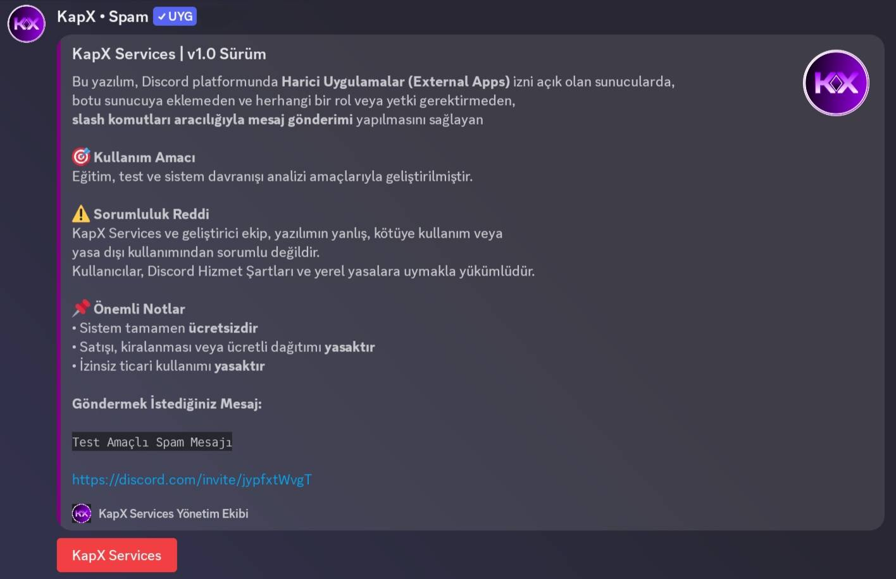
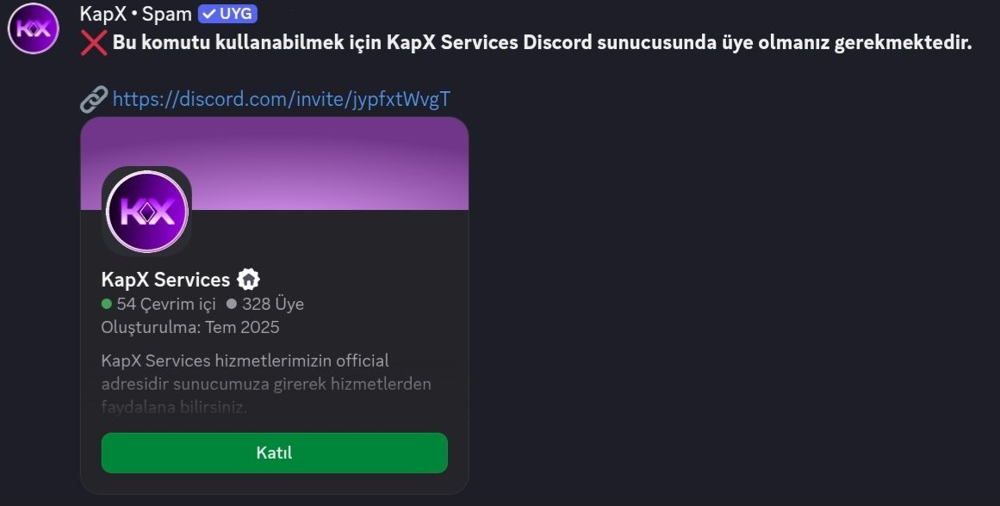

# KapX Services – Discord Spam Bot  
### v1.0.0

---

## Tanım

**KapX Services Discord Spam Bot**,  
Discord platformunda **harici uygulamalar (External Apps) izninin açık olduğu sunucularda**,  
**botu sunucuya eklemeden** ve **rol/yetki gerektirmeden**,  
**slash komut aracılığıyla mesaj gönderimi** yapılmasını sağlayan  
**stabil sürüme geçirilmiş** bir yazılımdır.

Bu bot, **eğitim, test ve sistem davranışı analizi** amaçlarıyla geliştirilmiştir.

---

## Sürüm ve Kimlik Bilgileri

- **Bot Adı:** KapX Services Discord Spam Bot  
- **Sürüm Durumu:** v1.0.0 (Stabil)  
- **Geliştirici:** KapBilly7581  
- **Geliştiren Ekip:** KapX Services  
- **Dağıtım:** Ücretsiz  
- **Çalışma Yapısı:**  
  - Slash Command tabanlı  
  - Harici uygulama (External Apps) yetkisi kullanır  
  - Sunucuya bot ekleme gerektirmez (izinli ortamlarda)

> **Bilgilendirme:** v1.0.0 sürümü, Beta aşamasından çıkışı temsil eder.

---

## Ne Yapar?

- Discord slash komutu üzerinden mesaj gönderimi sağlar  
- Harici uygulamalara izin verilmiş sunucularda çalışır  
- Botun sunucuya eklenmesine gerek yoktur  
- Rol veya yönetici yetkisi gerektirmez  
- Kullanıcı doğrulaması yaparak erişim kontrolü sağlar  
- Mobil, masaüstü ve web Discord ile uyumludur  

---

## Ne Yapmaz?

- Discord güvenlik sistemlerini aşmaz  
- Yetkisiz veya izin verilmeyen sunucularda çalışmaz  
- Exploit, bypass veya otomatik açık istismarı içermez  
- Discord hizmet şartlarını ihlal edecek gizli işlemler yapmaz  

---

## 🔖 Sürüm Güncellemesi — v1.0.0

Bu sürüm, **Beta aşamasından v1.0.0 sürüme geçişi** temsil eder.  
Sistem mimarisi olgunlaştırılmış, **erişim, güvenlik ve kullanım kontrolleri güçlendirilmiştir**.

---

### 🚀 v1.0.0 ile Gelen Yenilikler

#### 1️⃣ Kullanıcı Doğrulama Sistemi  
*(KapX Services Sunucu Üyeliği Kontrolü)*

- Slash komut kullanımı için **KapX Services Discord sunucusuna üyelik zorunlu hale getirildi**
- Kontrol **Discord API üzerinden canlı (fetch) yöntemiyle** yapılır
- Cache bağımlılığı yoktur
- External Apps ortamlarıyla %100 uyumludur
- Sunucudan ayrılan kullanıcılar anında sistem dışı bırakılır

---

#### 2️⃣ Geliştirilmiş Embed Arayüzü (Kurumsal UI)

- Kurumsal mor tema (**#800080**) embed tasarımı
- Bot profil fotoğrafı ile görsel bütünlük
- Daha okunabilir ve resmi dokümantasyon yapısı
- Mobil ve masaüstü Discord için optimize edilmiş görünüm

---

#### 3️⃣ External Apps Uyum İyileştirmeleri

- Discord Harici Uygulamalar sistemine özel mimari düzenleme
- Yetki, rol veya bot ekleme gereksinimi olmadan çalışma
- Slash komut tetikleme stabilitesi artırıldı
- API hata yakalama ve güvenli fallback mekanizması eklendi

---

#### 4️⃣ Hukuki & Lisans Güncellemesi

- Lisans açık şekilde **CC BY-NC-SA 4.0** olarak tanımlandı
- Hukuki sorumluluk reddi netleştirildi
- Ticari kullanım ve yeniden dağıtım şartları açıklandı
- Dokümantasyon resmi teknik belge formatına getirildi

---

## Lisans

Bu yazılım aşağıdaki lisans kapsamında dağıtılmaktadır:

**Creative Commons Attribution–NonCommercial–ShareAlike 4.0**  
(CC BY-NC-SA 4.0)  
https://creativecommons.org/licenses/by-nc-sa/4.0/

---

## Hukuki Sorumluluk Reddi

Bu bot **yalnızca eğitim ve test amaçlıdır**.

- Geliştirici ve KapX Services ekibi,  
  yazılımın yanlış veya yasa dışı kullanımından sorumlu tutulamaz.
- Kullanıcılar, **yerel yasalar** ve **Discord Hizmet Şartları**na uymakla yükümlüdür.
- Rızası olmayan kişi veya sunuculara karşı kullanımı hukuka aykırıdır.

---

## Kullanım Süreci (Özet)

### 1. Yetkilendirme
https://discord.com/oauth2/authorize?client_id=1456685714220515597

### 2. Discord Yenileme
- Bilgisayar: `F5`  
- Mobil / Tablet: Uygulamayı kapatıp yeniden açınız

### 3. Komut Kullanımı
/kapxspam
Mesaj alanı doldurulduktan sonra KapX Services arayüzü üzerinden işlem başlatılır.

---

## Önemli Notlar

- Sistem tamamen **ücretsizdir**
- Satışı, kiralanması veya ücretli dağıtımı yasaktır
- KapX Services izni olmadan ticari projelerde kullanılamaz
- v1.0.0 sürümü stabil kabul edilir

---

## Resmi İletişim

KapX Services Discord Sunucusu:  
https://discord.com/invite/jypfxtWvgT

---

**KapX Services Yönetim Ekibi**  

## Güncelleme Resimleri v1.0.0

